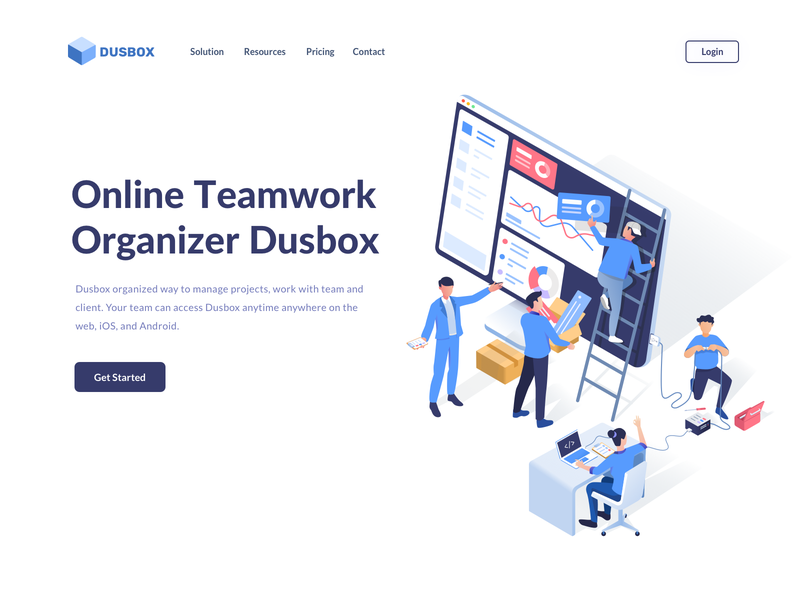
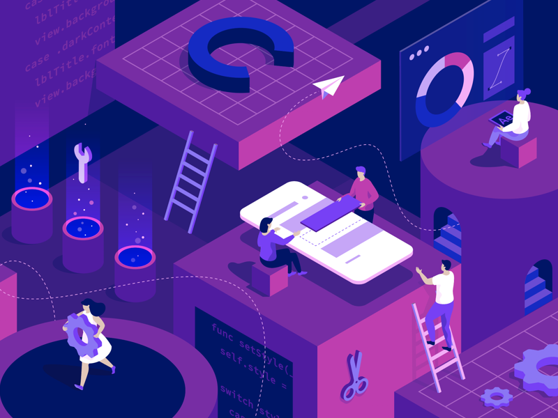
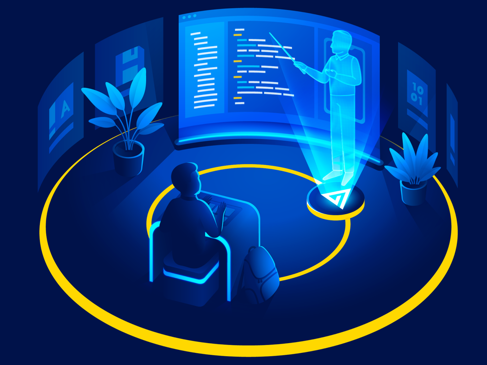
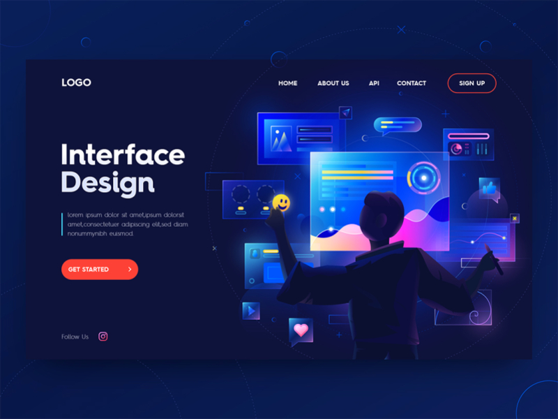

# Inspiration

## Univers graphique

J'ai pris cette image car ce sera l'univers graphique de mon portfolio, j'imagine peut-être mettre un téléphone, puis une tablette, puis un portable, puis un écran d'ordinateur par exemple pour faire les différentes couches.

Cette image ci-dessous est le résultat de l'élément graphique qui figurera sur la **landing page** de mon portfolio.

J'ai pris cet image pour montrer un rendu différent avec un thème plus clair.

Bien que je n'aime pas beaucoup cette illustration, je l'ai mise dans le but de voir ce thème que j'aime bien avec de la 3d avec d'autres couleurs, d'autres formes.

## Deuxième proposition d'univers graphique

Ce que j'aime dans cet univers, c'est le contraste entre la typo qui est nette et la carte qui ne l'es plus avec l'effet de grains ajouté.

## Troisième proposition d'univers graphique

Dans cet univers graphique, ce que j'aime énormément, c'est l'effet de futur qui est mis en avant avec des hologrammes.

Ici, on retrouve un peu l'idée du futurisme avec des hologramme, des couleurs vive avec des effet de lumières, sur cet image le fond peut-être animable ce qui serait un plus pour attirer l'attention du visiteur.

## Bouton de réseaux sociaux

Cette image m'a toute suite inspirée pour ses couleurs et aussi son design, l'inspiration qui me vient quand je vois cette image, ce sont les boutons, je pourrais faire les mêmes en changeant les couleurs en fonction de ma future palette pour les réseaux sociaux.

