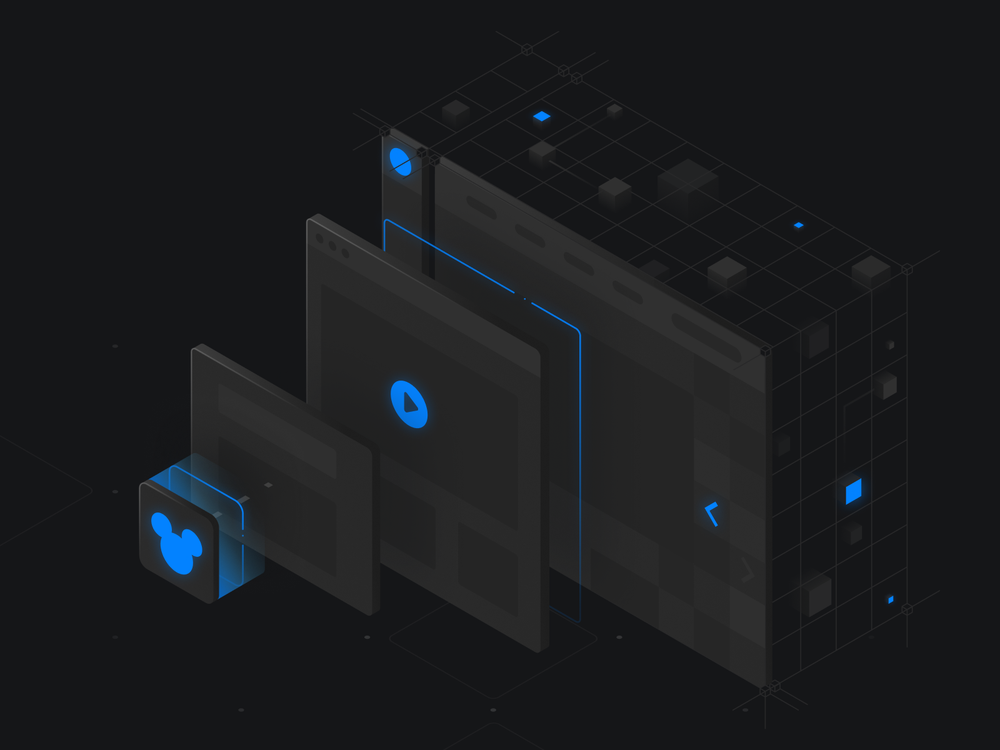
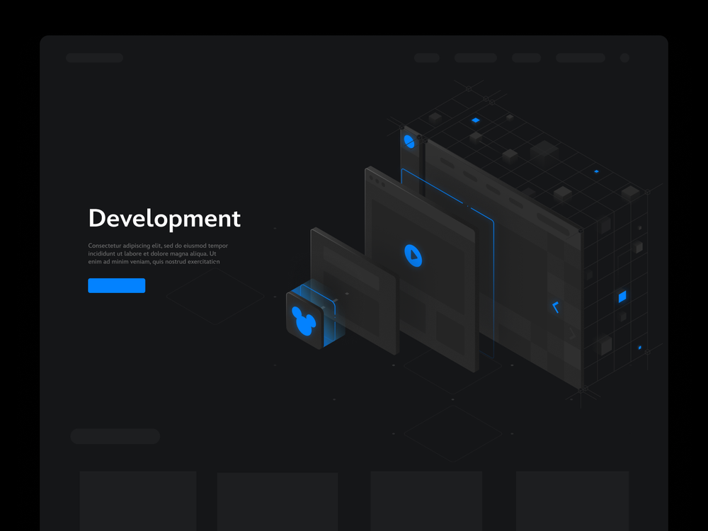
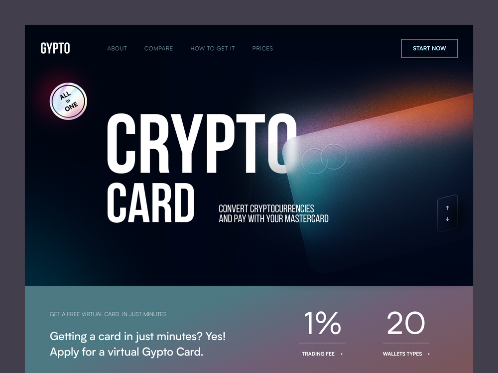
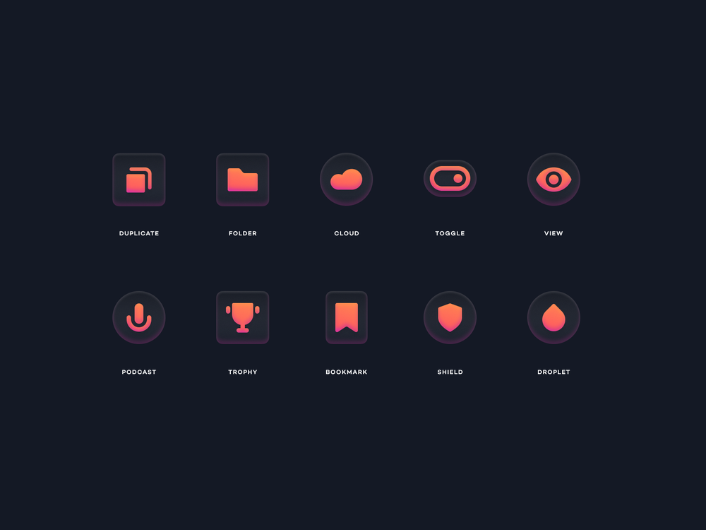

# Inspiration

## Univers graphique

J'ai pris cette image car ce sera l'univers graphique de mon portfolio, j'imagine peut-être mettre un téléphone, puis une tablette, puis un portable, puis un écran d'ordinateur par exemple pour faire les différentes couches.

Cette image ci-dessous est le résultat de l'élément graphique qui figurera sur la **landing page** de mon portfolio.

## Deuxième proposition d'univers graphique

Ce que j'aime dans cet univers, c'est le contraste entre la typo qui est nette et la carte qui ne l'es plus avec l'effet de grains ajouté.

## Bouton de réseaux sociaux

Cette image m'a toute suite inspirée pour ses couleurs et aussi son design, l'inspiration qui me vient quand je vois cette image, ce sont les boutons, je pourrais faire les mêmes en changeant les couleurs en fonction de ma future palette pour les réseaux sociaux.

